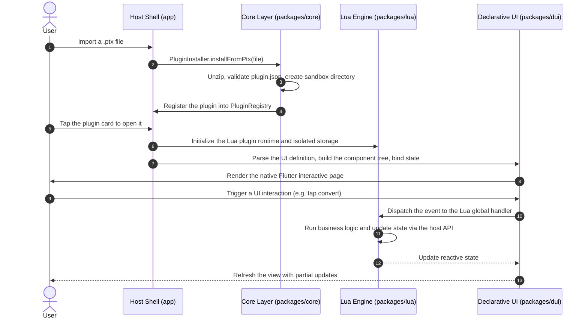

<div align="center">


# PluginToolbox

**PluginToolbox — A modern Android toolbox powered by lightweight sandboxes and declarative dynamic UI.**

A deeply decoupled, fully offline, and hot-pluggable Android toolbox application. Without recompiling the host, users can import a single `.ptx` plugin package and run entirely new functionality instantly.

[](https://flutter.dev)
[](https://dart.dev)
[](#installation--usage)
[](LICENSE)
[](#architecture)
[](https://github.com/Aclguh/plugin-toolbox/actions/workflows/ci.yml)
[](https://github.com/Aclguh/plugin-toolbox/releases/latest)

[简体中文](README.md) · **English**

</div>

---

## Download

Head to the [Releases](https://github.com/Aclguh/plugin-toolbox/releases/latest) page for the latest version **v0.1.0** and pick the APK matching your device ABI:

| ABI | Target devices | Artifact |
|---|---|---|
| arm64-v8a | Mainstream Android phones (recommended) | `app-arm64-v8a-release.apk` |
| armeabi-v7a | Legacy 32-bit devices | `app-armeabi-v7a-release.apk` |
| x86_64 | Emulators | `app-x86_64-release.apk` |

After installing, import a `.ptx` plugin package in the Plugin Manager to enable new features.

---

## Core Features

- **Hot-Pluggable Plugin Ecosystem**:
  - `.ptx` (Plugin Toolbox Extension) packages based on the standard Zip archive format, supporting one-click installation, immediate activation, and safe uninstallation.
  - Every dynamic plugin owns an isolated sandbox storage space, preventing data contamination and unauthorized access between plugins.
- **Declarative Dynamic UI (DUI)**:
  - Component trees described in pure JSON, mapped natively into high-performance Flutter widgets by the host runtime.
  - Reactive data binding plus an event-driven mechanism — no convoluted front-end logic required.
- **Lightweight Sandboxed Scripting Engine**:
  - A built-in sandbox-level Lua runtime that is both high-performance and lightweight.
  - A safe host API surface: clipboard, sandbox storage, and system information.

---

## Architecture

This project is organized as a clean Monorepo with single-responsibility, unidirectional dependencies:

```
plugin-toolbox/
├── app/                  # Android host application (Flutter App)
│   ├── lib/              # Pages, routing (go_router), global state (Riverpod)
│   └── test/             # Host widget tests & component interaction tests
├── packages/
│   ├── core/             # Domain core: plugin models, registry, installer & sandbox security (Pure Dart)
│   ├── lua/              # Script execution: Lua engine & sandbox API bindings (with instruction budget)
│   ├── dui/              # Declarative UI engine: JSON AST -> Flutter Widget dynamic rendering
│   ├── ui/               # Shared presentation: AppTheme brand design system & reusable widget library
│   └── third_party/
│       └── lua_dardo/    # Locally maintained Lua VM fork (Apache-2.0): adds instruction budget
├── sample_plugins/       # Official reference plugins with packing scripts
│   ├── base64_tool/      # Base64 text encoder/decoder plugin
│   └── hash_tool/        # MD5 / SHA-1 / SHA-256 hash calculator plugin
├── tool/                 # Standalone quality engineering toolkit (verify.dart, shots.py)
└── .github/workflows/    # CI pipeline: analyze + verify + all-package tests
```

### Plugin Loading & Execution Flow



---

## `.ptx` Plugin Specification & Authoring Guide

A standard `.ptx` is simply an ordinary Zip archive (with a `.ptx` extension); the host
unzips it into the plugin's isolated sandbox directory at install time. The package
structure, manifest fields, declarative UI syntax, and host Lua API follow the production
implementation in this repository — refer to the official samples under `sample_plugins/`
(base64_tool, hash_tool).

### Cross-Platform Packaging (`sample_plugins/pack.py`)

Run the cross-platform Python packaging script from the repository root:

```bash
# Pack all plugin directories into .ptx
python sample_plugins/pack.py

# Or pack a specific plugin
python sample_plugins/pack.py base64_tool
```

---

## Installation & Usage

### 1. Building from Source

Prerequisites:
- Flutter SDK 3.29+ / Dart SDK 3.7+
- Android SDK (API 34+), Java 17+
- Python 3.10+ (for plugin packaging and icon scripts only)

```bash
# Clone the repository
git clone https://github.com/Aclguh/plugin-toolbox.git
cd plugin-toolbox

# Fetch dependencies
cd app && flutter pub get

# Start debugging (requires a connected device or a running emulator)
flutter run
```

### 2. Production Build (Split APK)

To minimize package size, splitting by ABI is recommended:

```bash
cd app
flutter build apk --release --split-per-abi
# Artifacts:
# - build/app/outputs/flutter-apk/app-arm64-v8a-release.apk (recommended for mainstream devices)
# - build/app/outputs/flutter-apk/app-armeabi-v7a-release.apk (older devices)
# - build/app/outputs/flutter-apk/app-x86_64-release.apk (emulators)
```

---

## Verification & Testing

```bash
# 1. Static code analysis (0 warnings, 0 errors)
dart analyze

# 2. Automated specification and logic verification (83 assertions, pure Dart)
dart run tool/verify.dart

# 3. Layered unit & widget tests (pure software testing, 119 cases, no devices needed)
cd packages/core && flutter test
cd packages/lua && flutter test
cd packages/dui && flutter test
cd packages/ui && flutter test
cd app && flutter test

# 4. On-device visual & layout inspection (with connected Android device)
python tool/shots.py 01-home 02-manager 03-settings
```

### Unified task entry (melos)

```bash
melos run analyze        # Per-package static analysis
melos run test           # Per-package tests
melos run verify         # Standalone verification suite
melos run pack:plugins   # Pack sample plugins into .ptx
melos run build:apk      # Build release APKs (split-per-abi)
```

---

## License & Acknowledgements

- This project is open-sourced under the [MIT License](LICENSE).
- Core dependencies:
  - [Flutter](https://flutter.dev) & [Dart](https://dart.dev)
  - [Riverpod](https://riverpod.dev) — high-performance reactive state management
  - [GoRouter](https://pub.dev/packages/go_router) — declarative routing and navigation
  - [Archive](https://pub.dev/packages/archive) — high-performance cross-platform archive engine
  - [ReorderableGridView](https://pub.dev/packages/reorderable_grid_view) — smooth grid drag-and-drop reordering
