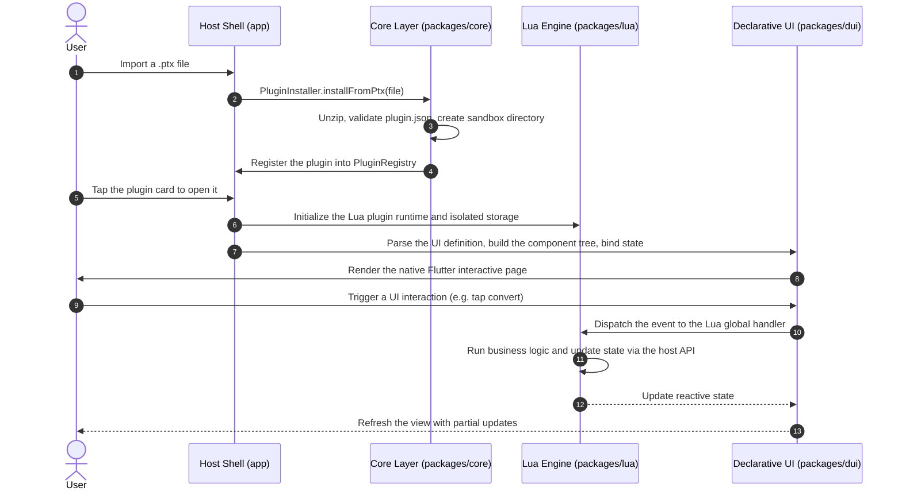
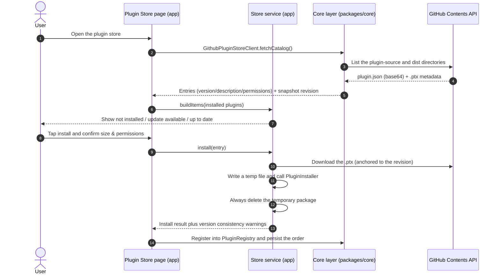

<div align="center">


# PluginToolbox

**PluginToolbox — A modern Android toolbox powered by lightweight sandboxes and declarative dynamic UI.**

A deeply decoupled and hot-pluggable Android toolbox application. Users can either import a local `.ptx` plugin package or install and update plugins online from the in-app plugin store — no host recompilation required, and new functionality runs instantly.

[](https://flutter.dev)
[](https://dart.dev)
[](#installation--usage)
[](LICENSE)
[](#architecture)
[](https://github.com/Aclguh/plugin-toolbox/actions/workflows/ci.yml)
[](https://github.com/Aclguh/plugin-toolbox/releases/latest)

[简体中文](README.md) · **English**

</div>

---

## Download

Head to the [Releases](https://github.com/Aclguh/plugin-toolbox/releases/latest) page for the latest version **v0.1.0** and pick the APK matching your device ABI:

| ABI | Target devices | Artifact |
|---|---|---|
| arm64-v8a | Mainstream Android phones (recommended) | `app-arm64-v8a-release.apk` |
| armeabi-v7a | Legacy 32-bit devices | `app-armeabi-v7a-release.apk` |
| x86_64 | Emulators | `app-x86_64-release.apk` |

After installing, browse and one-click install/update plugins in the in-app **Plugin Store** (metadata comes from the `plugin-source` manifests of [Aclguh/PTX-plugins](https://github.com/Aclguh/PTX-plugins)), or import a local `.ptx` package in the Plugin Manager.

---

## Core Features

- **Built-in Plugin Store (online install & update)**:
  - Metadata — version, description, author, category and permissions — is read from `plugin-source/<id>/plugin.json` via the GitHub Contents API, while the installable artifact comes from `dist/<id>.ptx`.
  - Each entry shows "not installed / update available / up to date"; the confirmation dialog surfaces package size and permissions, re-installing the same id acts as a plugin update, and the plugin appears on the home grid immediately.
  - The downloaded package is written to a temporary file before being handed to the very same installer used for local imports, and that temporary file is always cleaned up.
- **Hot-Pluggable Plugin Ecosystem**:
  - `.ptx` (Plugin Toolbox Extension) packages based on the standard Zip archive format, supporting one-click installation, immediate activation, and safe uninstallation.
  - Every dynamic plugin owns an isolated sandbox storage space, preventing data contamination and unauthorized access between plugins.
- **Declarative Dynamic UI (DUI)**:
  - Component trees described in pure JSON, mapped natively into high-performance Flutter widgets by the host runtime.
  - Reactive data binding plus an event-driven mechanism — no convoluted front-end logic required.
- **Lightweight Sandboxed Scripting Engine**:
  - A built-in sandbox-level Lua runtime that is both high-performance and lightweight.
  - A safe host API surface: clipboard, sandbox storage, and system information.

---

## Architecture

This project is organized as a clean Monorepo with single-responsibility, unidirectional dependencies:

```
plugin-toolbox/
├── app/                  # Android host application (Flutter App)
│   ├── lib/              # Pages, routing (go_router), global state (Riverpod)
│   │   └── src/plugin_store/  # Plugin store page & install orchestration service
│   └── test/             # Host widget tests & component interaction tests
├── packages/
│   ├── core/             # Domain core: plugin models, registry, installer & sandbox security (Pure Dart)
│   │   └── src/store/    # Store catalog client & version semantics (GitHub Contents API)
│   ├── lua/              # Script execution: Lua engine & sandbox API bindings (with instruction budget)
│   ├── dui/              # Declarative UI engine: JSON AST -> Flutter Widget dynamic rendering
│   ├── ui/               # Shared presentation: AppTheme brand design system & reusable widget library
│   └── third_party/
│       └── lua_dardo/    # Locally maintained Lua VM fork (Apache-2.0): adds instruction budget
├── sample_plugins/       # Official reference plugins with packing scripts
│   ├── base64_tool/      # Base64 text encoder/decoder plugin
│   └── hash_tool/        # MD5 / SHA-1 / SHA-256 hash calculator plugin
├── tool/                 # Standalone quality engineering toolkit (verify.dart, shots.py)
└── .github/workflows/    # CI pipeline: analyze + verify + all-package tests
```

### Plugin Loading & Execution Flow



### Plugin Store Install Flow

The store separates remote metadata from local install state: version, description, author,
category and permissions all come from the plugin repository's `plugin-source/<id>/plugin.json`,
while the artifact comes from `dist/<id>.ptx`. Once downloaded, the package goes through
exactly the same `PluginInstaller` validation and sandbox extraction path as a local import.



---

## Plugin Store Configuration

The store points at the plugin development repository [Aclguh/PTX-plugins](https://github.com/Aclguh/PTX-plugins)
by default; the coordinates live in `app/lib/src/plugin_store/store_providers.dart`:

| Setting | Default | Notes |
|---|---|---|
| `kPluginStoreOwner` | `Aclguh` | Repository owner |
| `kPluginStoreRepository` | `PTX-plugins` | Repository name |
| Preferred branch | `master` | Falls back to the repo default branch when missing |
| Metadata path | `plugin-source/<id>/plugin.json` | Version, description, author, category, permissions |
| Artifact path | `dist/<id>.ptx` | Installable package (10MB cap, same as `PluginInstaller`) |

Design notes:

- **GitHub Contents API only**: `raw.githubusercontent.com` is unreachable on some networks,
  whereas the Contents API returns base64 bodies that can both be parsed as a manifest and
  written straight to disk as a package.
- **Snapshot consistency**: the directory listing's `sha` anchors the subsequent manifest and
  package requests, so the listed version and the downloaded artifact always come from the
  same commit.
- **Dirty data isolation**: a broken or incomplete `plugin.json` only skips that entry (with a
  header hint) instead of failing the whole catalog; rate limits, timeouts and offline states
  surface readable messages.
- **Install-state semantics**: `PluginStoreSemantics` offers pure version comparison (missing
  segments filled with zeros, `v` prefix and `+build` suffix allowed, non-numeric segments
  zeroed) that drives the not-installed / update-available / up-to-date distinction.

---

## `.ptx` Plugin Specification & Authoring Guide

A standard `.ptx` is simply an ordinary Zip archive (with a `.ptx` extension); the host
unzips it into the plugin's isolated sandbox directory at install time. The package
structure, manifest fields, declarative UI syntax, and host Lua API follow the production
implementation in this repository — refer to the official samples under `sample_plugins/`
(base64_tool, hash_tool).

### Cross-Platform Packaging (`sample_plugins/pack.py`)

Run the cross-platform Python packaging script from the repository root:

```bash
# Pack all plugin directories into .ptx
python sample_plugins/pack.py

# Or pack a specific plugin
python sample_plugins/pack.py base64_tool
```

---

## Installation & Usage

### 1. Building from Source

Prerequisites:
- Flutter SDK 3.29+ / Dart SDK 3.7+
- Android SDK (API 34+), Java 17+
- Python 3.10+ (for plugin packaging and icon scripts only)

```bash
# Clone the repository
git clone https://github.com/Aclguh/plugin-toolbox.git
cd plugin-toolbox

# Fetch dependencies
cd app && flutter pub get

# Start debugging (requires a connected device or a running emulator)
flutter run
```

### 2. Production Build (Split APK)

To minimize package size, splitting by ABI is recommended:

```bash
cd app
flutter build apk --release --split-per-abi
# Artifacts:
# - build/app/outputs/flutter-apk/app-arm64-v8a-release.apk (recommended for mainstream devices)
# - build/app/outputs/flutter-apk/app-armeabi-v7a-release.apk (older devices)
# - build/app/outputs/flutter-apk/app-x86_64-release.apk (emulators)
```

---

## Verification & Testing

```bash
# 1. Static code analysis (0 warnings, 0 errors)
dart analyze

# 2. Automated specification and logic verification (117 assertions, pure Dart)
dart run tool/verify.dart

# 3. Layered unit & widget tests (pure software testing, 186 cases, no devices needed)
#    packages/core 54 / packages/lua 68 / packages/dui 28 / packages/ui 6 / app 30
cd packages/core && flutter test
cd packages/lua && flutter test
cd packages/dui && flutter test
cd packages/ui && flutter test
cd app && flutter test

# 4. On-device visual & layout inspection (with connected Android device)
python tool/shots.py 01-home 02-manager 03-settings
```

### Unified task entry (melos)

```bash
melos run analyze        # Per-package static analysis
melos run test           # Per-package tests
melos run verify         # Standalone verification suite
melos run pack:plugins   # Pack sample plugins into .ptx
melos run build:apk      # Build release APKs (split-per-abi)
```

---

## License & Acknowledgements

- This project is open-sourced under the [MIT License](LICENSE).
- Core dependencies:
  - [Flutter](https://flutter.dev) & [Dart](https://dart.dev)
  - [Riverpod](https://riverpod.dev) — high-performance reactive state management
  - [GoRouter](https://pub.dev/packages/go_router) — declarative routing and navigation
  - [Archive](https://pub.dev/packages/archive) — high-performance cross-platform archive engine
  - [ReorderableGridView](https://pub.dev/packages/reorderable_grid_view) — smooth grid drag-and-drop reordering


