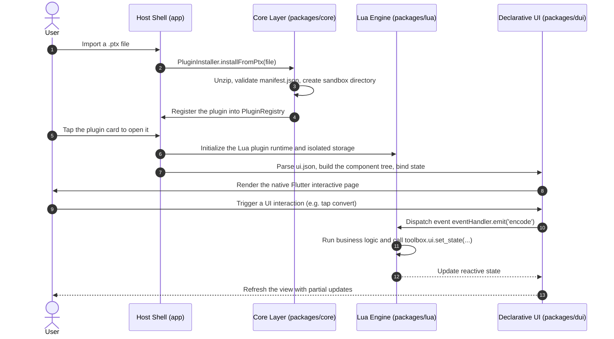

<div align="center">


# PluginToolbox

**PluginToolbox — A modern Android toolbox powered by lightweight sandboxes and declarative dynamic UI.**

A deeply decoupled, fully offline, and hot-pluggable Android toolbox application. Without recompiling the host, users can import a single `.ptx` plugin package and run entirely new functionality instantly.

[](https://flutter.dev)
[](https://dart.dev)
[](#installation--usage)
[](LICENSE)
[](#architecture)

[简体中文](README.md) · **English**

</div>

---

## Core Features

- **Hot-Pluggable Plugin Ecosystem**:
  - `.ptx` (Plugin Toolbox Extension) packages based on the standard Zip archive format, supporting one-click installation, immediate activation, and safe uninstallation.
  - Every dynamic plugin owns an isolated sandbox storage space, preventing data contamination and unauthorized access between plugins.
- **Declarative Dynamic UI (DUI)**:
  - Component trees described in pure JSON (`ui.json`), mapped natively into high-performance Flutter widgets by the host runtime.
  - Reactive data binding via `${state.key}` plus an event-driven mechanism — no convoluted front-end logic required.
- **Lightweight Sandboxed Scripting Engine**:
  - A built-in sandbox-level Lua runtime (`entry.lua`) that is both high-performance and lightweight.
  - A safe host API surface: clipboard (`toolbox.clipboard`), sandbox storage (`toolbox.storage`), system information, and structured logging.

---

## Architecture

This project is organized as a clean Monorepo with single-responsibility, unidirectional dependencies:

```
plugin-toolbox/
├── app/                  # Android host application (Flutter App)
│   ├── lib/              # Pages, routing (go_router), global state (Riverpod)
│   └── test/             # Host widget tests & component interaction tests
├── packages/
│   ├── core/             # Domain core: plugin models, registry, installer, isolation services (Pure Dart)
│   ├── lua/              # Script execution: Lua 5.1/LuaJIT engine & sandbox API bindings
│   ├── dui/              # Declarative UI engine: JSON AST -> Flutter Widget dynamic rendering
│   └── ui/               # Shared presentation: AppTheme brand design system & reusable widget library
├── sample_plugins/       # Official reference plugins with packing scripts
│   ├── base64_tool/      # Base64 text encoder/decoder plugin
│   └── hash_tool/        # MD5 / SHA-1 / SHA-256 hash calculator plugin
└── AGENTS.md             # Unified architecture standards, quality gates & AI Agent guidelines
```

### Plugin Loading & Execution Flow



---

## `.ptx` Plugin Specification & Authoring Guide

A standard `.ptx` is simply an ordinary Zip archive (with a `.ptx` extension) whose root contains the following files:

```
my_plugin.ptx
├── manifest.json         # Plugin manifest and metadata (required)
├── entry.lua             # Core logic script (required)
├── ui.json               # Declarative component tree definition (required)
└── icon.png              # Plugin icon, recommended 128x128 PNG (optional)
```

### 1. Plugin Manifest (`manifest.json`)

```json
{
  "id": "base64_tool",
  "name": "Base64 Codec",
  "version": "1.0.0",
  "description": "Base64 text encoder and decoder utility",
  "author": "PluginToolbox Team",
  "type": "lua",
  "category": "utility",
  "entry": "entry.lua",
  "ui": "ui.json",
  "permissions": ["storage", "clipboard"]
}
```

### 2. Declarative UI (`ui.json`)

```json
{
  "type": "Column",
  "props": {
    "crossAxisAlignment": "stretch"
  },
  "children": [
    {
      "type": "TextField",
      "props": {
        "label": "Input text",
        "value": "${state.input_text}",
        "maxLines": 4
      },
      "events": {
        "onChanged": "on_input_changed"
      }
    },
    {
      "type": "Row",
      "children": [
        {
          "type": "ElevatedButton",
          "props": { "label": "Encode" },
          "events": { "onTap": "on_encode" }
        }
      ]
    },
    {
      "type": "Card",
      "children": [
        {
          "type": "Text",
          "props": { "text": "${state.result_text}" }
        }
      ]
    }
  ]
}
```

### 3. Business Logic Script (`entry.lua`)

```lua
-- Initialize plugin state
toolbox.ui.set_state({
    input_text = "",
    result_text = ""
})

-- Input text listener
function on_input_changed(value)
    toolbox.ui.set_state({ input_text = value })
end

-- Encode button handler
function on_encode()
    local text = toolbox.ui.get_state("input_text") or ""
    local encoded = toolbox.crypto.base64_encode(text)
    toolbox.ui.set_state({ result_text = encoded })
end
```

### 4. One-Click Packaging Script (`pack.py`)

Run the following in the plugin source root:

```bash
python pack.py
# Generates a validated <plugin_id>.ptx in the dist/ directory
```

---

## Installation & Usage

### 1. Building from Source

Prerequisites:
- Flutter SDK 3.29+ / Dart SDK 3.7+
- Android SDK (API 34+), Java 17+
- Python 3.10+ (for plugin packaging and icon scripts only)

```bash
# Clone the repository
git clone https://github.com/Aclguh/plugin-toolbox.git
cd plugin-toolbox

# Fetch dependencies
cd app && flutter pub get

# Start debugging (requires a connected device or a running emulator)
flutter run
```

### 2. Production Build (Split APK)

To minimize package size, splitting by ABI is recommended:

```bash
cd app
flutter build apk --release --split-per-abi
# Artifacts:
# - build/app/outputs/flutter-apk/app-arm64-v8a-release.apk (recommended for mainstream devices)
# - build/app/outputs/flutter-apk/app-armeabi-v7a-release.apk (older devices)
# - build/app/outputs/flutter-apk/app-x86_64-release.apk (emulators)
```

---

## Verification & Testing

Strict automated quality gates are enforced throughout development (see [AGENTS.md](AGENTS.md)), adhering to the principle that **software testing focuses solely on the software infrastructure and host system itself, not on dynamic plugin business logic**:

```bash
# 1. Static code analysis (0 warnings, 0 errors)
dart analyze

# 2. Automated specification and logic verification (verify.dart suite)
dart run tool/verify.dart

# 3. Layered unit & widget tests (pure software testing, no devices needed)
cd packages/core && flutter test
cd packages/lua && flutter test
cd packages/dui && flutter test
cd packages/ui && flutter test
cd app && flutter test

# 4. On-device visual & layout inspection (with connected Android device)
python tool/shots.py 01-home 02-manager 03-settings
```

---

## License & Acknowledgements

- This project is open-sourced under the [MIT License](LICENSE).
- Core dependencies:
  - [Flutter](https://flutter.dev) & [Dart](https://dart.dev)
  - [Riverpod](https://riverpod.dev) — high-performance reactive state management
  - [GoRouter](https://pub.dev/packages/go_router) — declarative routing and navigation
  - [Archive](https://pub.dev/packages/archive) — high-performance cross-platform archive engine
  - [ReorderableGridView](https://pub.dev/packages/reorderable_grid_view) — smooth grid drag-and-drop reordering
