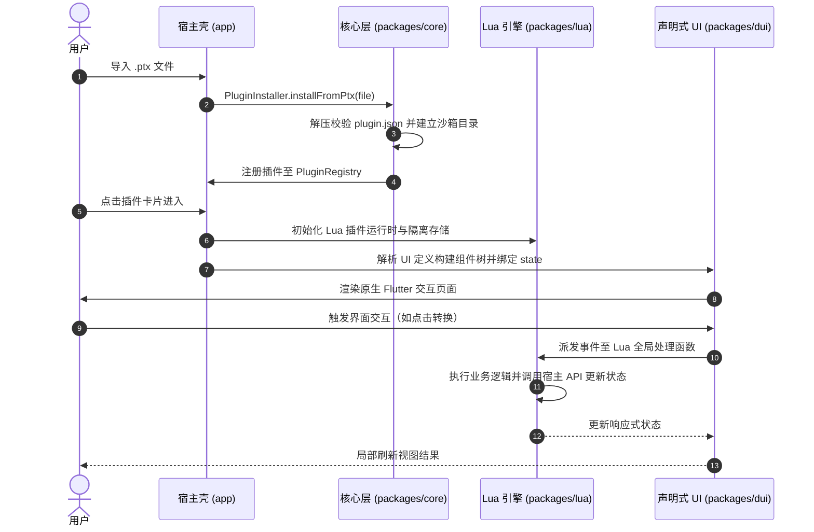
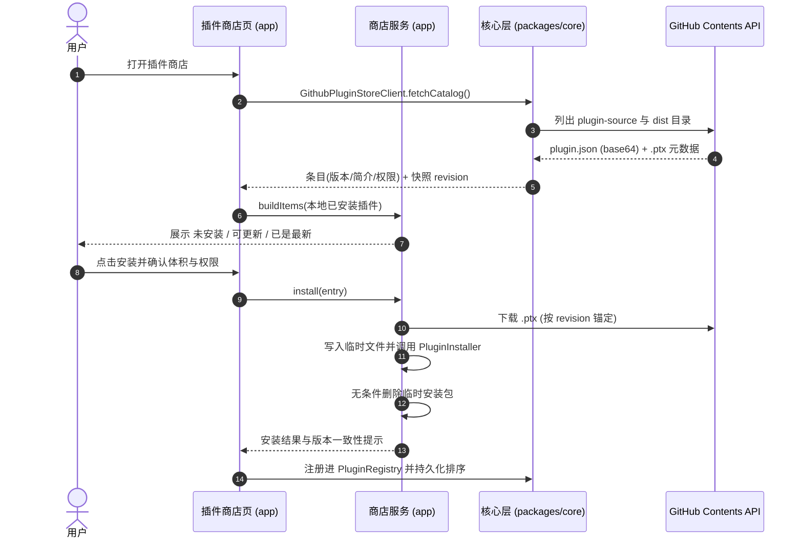

<div align="center">


# PluginToolbox

**PluginToolbox —— 基于轻量沙箱与动态声明式 UI 的 Android 插件工具箱**

一个高度解耦、支持热插拔的现代化 Android 工具箱应用。用户既可以导入本地 `.ptx` 插件包，也可以直接在应用内的插件商店在线安装与更新插件，无需重新编译宿主即可即时运行全新功能。

[](https://flutter.dev)
[](https://dart.dev)
[](#安装与运行)
[](LICENSE)
[](#架构设计)
[](https://github.com/Aclguh/plugin-toolbox/actions/workflows/ci.yml)
[](https://github.com/Aclguh/plugin-toolbox/releases/latest)

**简体中文** · [English](README.en.md)

</div>

---

## 下载

前往 [Releases](https://github.com/Aclguh/plugin-toolbox/releases/latest) 页面获取最新版本 **v0.2.0**，按设备架构选择对应 APK 安装：

| 架构 | 适用设备 | 安装包 |
|---|---|---|
| arm64-v8a | 主流安卓手机（推荐） | `app-arm64-v8a-release.apk` |
| armeabi-v7a | 老旧 32 位机型 | `app-armeabi-v7a-release.apk` |
| x86_64 | 模拟器 | `app-x86_64-release.apk` |

安装后可在「插件商店」在线浏览并一键安装/更新插件（元数据取自 [Aclguh/PTX-plugins](https://github.com/Aclguh/PTX-plugins) 的 `plugin-source` 清单），也可在「插件管理中心」导入本地 `.ptx` 插件包。

---

## 核心特性

- **内置插件商店（在线安装与更新）**：
  - 从插件仓库的 Contents API 拉取 `plugin-source/<id>/plugin.json` 获取**版本号、简介、作者、分类与权限**，从 `dist/<id>.ptx` 下载安装包。
  - 逐条展示"未安装 / 可更新 / 已是最新"，安装前确认体积与权限，同 ID 覆盖即插件更新，安装完成立即出现在首页。
  - 安装包下载后先落盘再交给安装器校验解压，临时文件无条件清理，绝不留下残留产物。
- **动态热插拔插件生态**：
  - 基于标准 Zip 归档格式的 `.ptx` (Plugin Toolbox Extension) 插件包，支持一键安装、即刻启用与安全卸载。
  - 每个动态插件拥有独立沙箱存储空间，防止插件间数据污染与越权访问。
- **声明式动态 UI (DUI)**：
  - 纯 JSON 描述组件树，由宿主运行时原生映射为高性能 Flutter Widget。
  - 支持响应式数据绑定与事件驱动机制，无需编写复杂的前端逻辑。
- **轻量受控脚本引擎**：
  - 内置沙箱级 Lua 脚本运行时，兼具高性能与轻量化。
  - 提供安全宿主 API 集合：剪贴板、沙箱存储、系统信息。


---

## 架构设计

本工程采用清晰的 Monorepo 分层架构，各子模块职责单一、单向依赖：

```
plugin-toolbox/
├── app/                  # Android 宿主主工程（Flutter App）
│   ├── lib/              # 页面、路由 (go_router)、全局状态 (Riverpod)
│   │   └── src/plugin_store/  # 插件商店页与安装编排服务
│   └── test/             # 宿主 Widget 测试与组件交互测试
├── packages/
│   ├── core/             # 领域核心：插件模型、注册中心、安装器与沙箱安全（纯 Dart）
│   │   └── src/store/    # 插件商店目录客户端与版本语义（GitHub Contents API）
│   ├── lua/              # 脚本执行层：Lua 脚本引擎与沙箱 API 绑定（含指令数预算防护）
│   ├── dui/              # 声明式 UI 引擎：JSON AST -> Flutter Widget 动态渲染
│   ├── ui/               # 共享表现层：AppTheme 品牌主题系统与通用组件库
│   └── third_party/
│       └── lua_dardo/    # Lua VM 本地维护分支 (Apache-2.0)：新增指令数预算能力
├── sample_plugins/       # 官方样例插件源码与打包脚本 (pack.py)
│   ├── base64_tool/      # Base64 文本编解码插件
│   └── hash_tool/        # MD5 / SHA-1 / SHA-256 哈希计算插件
├── tool/                 # 独立质量工程工具套件 (verify.dart, shots.py)
└── .github/workflows/    # CI 流水线：analyze + verify + 全模块测试
```

### 插件加载与运行流程



### 插件商店安装流程

商店把「远端元数据」与「本地已安装态」分离：版本号、简介、作者、分类与权限全部来自
插件仓库 `plugin-source/<id>/plugin.json`，安装包则来自 `dist/<id>.ptx`；安装包在
落盘后仍走与本地导入完全相同的 `PluginInstaller` 校验与沙箱解压链路。



---

## `.ptx` 插件规范与编写指南

一个标准的 `.ptx` 实际上是一个普通的 Zip 归档包（后缀为 `.ptx`），由宿主在安装时
解压至插件独立沙箱目录。插件包结构、清单字段、声明式 UI 语法与宿主 Lua API 以仓库
生产实现为准，可直接参考官方样例 `sample_plugins/`（base64_tool、hash_tool）。

### 插件跨平台打包 (`sample_plugins/pack.py`)

在工程根目录下执行跨平台 Python 打包脚本：

```bash
# 一键打包所有插件目录为 .ptx
python sample_plugins/pack.py

# 或打包指定插件
python sample_plugins/pack.py base64_tool
```

---

## 插件商店配置

商店默认指向插件开发仓库 [Aclguh/PTX-plugins](https://github.com/Aclguh/PTX-plugins)，
坐标集中声明在 `app/lib/src/plugin_store/store_providers.dart`：

| 配置项 | 默认值 | 说明 |
|---|---|---|
| `kPluginStoreOwner` | `Aclguh` | 仓库所属用户/组织 |
| `kPluginStoreRepository` | `PTX-plugins` | 仓库名 |
| 首选分支 | `master` | 分支不存在时自动回退到仓库默认分支 |
| 元数据目录 | `plugin-source/<id>/plugin.json` | 版本号、简介、作者、分类、权限 |
| 产物目录 | `dist/<id>.ptx` | 安装包（上限 10MB，与 `PluginInstaller` 一致） |

设计要点：

- **只依赖 GitHub Contents API**：`raw.githubusercontent.com` 在部分网络环境下不可达，
  而 Contents API 返回的 base64 正文既能解析清单也能直接落盘为安装包。
- **快照一致**：目录列表返回的 `sha` 作为 revision 锚定后续的清单与安装包请求，
  避免"列表来自旧快照、下载却拿到新产物"。
- **脏数据隔离**：单个插件的 `plugin.json` 损坏或缺字段只跳过该条目并在页头提示，
  不会阻断整个目录；限流、超时、断网均给出可读中文提示。
- **安装态判定**：`PluginStoreSemantics` 提供纯函数的版本比较（缺失段补零、允许
  `v` 前缀与 `+build` 后缀、非数字段归零），据此区分未安装/可更新/已是最新。

---

## 安装与运行

### 1. 从源码编译

要求环境：
- Flutter SDK 3.29+ / Dart SDK 3.7+
- Android SDK (API 34+), Java 17+
- Python 3.10+ (用于质量工具与插件打包)

```bash
# 克隆仓库
git clone https://github.com/Aclguh/plugin-toolbox.git
cd plugin-toolbox

# 安装依赖
flutter pub get
cd app && flutter pub get

# 启动调试（需连接真机或启动模拟器）
flutter run
```

### 2. 生产打包 (Split APK)

为优化安装包体积，推荐按 ABI 拆分打包：

```bash
cd app
flutter build apk --release --split-per-abi
# 输出产物：
# - build/app/outputs/flutter-apk/app-arm64-v8a-release.apk (主流机型推荐)
# - build/app/outputs/flutter-apk/app-armeabi-v7a-release.apk (老旧机型)
# - build/app/outputs/flutter-apk/app-x86_64-release.apk (模拟器)
```

---

## 验证与测试


```bash
# 1. 静态代码分析（保持 0 错误 0 警告）
dart analyze

# 2. 独立规范与逻辑自动化验证（纯 Dart 快速执行，117 项断言全通过）
dart run tool/verify.dart

# 3. 分层单元测试与 Widget 测试（纯软件架构与宿主交互测试，无需外部设备，共 186 用例）
#    packages/core 54 / packages/lua 68 / packages/dui 28 / packages/ui 6 / app 30
cd packages/core && flutter test
cd packages/lua && flutter test
cd packages/dui && flutter test
cd packages/ui && flutter test
cd app && flutter test

# 4. 真机截图与视觉规范验证（需连接真机，自动裁剪系统栏并压缩）
python tool/shots.py 01-home 02-manager 03-settings
```

### 统一任务入口 (melos)

```bash
melos run analyze        # 各包静态分析
melos run test           # 各包测试
melos run verify         # 独立验证套件
melos run pack:plugins   # 打包示例插件
melos run build:apk      # 构建发布 APK
```

---


## 许可证与致谢

- 本项目源码采用 [MIT License](LICENSE) 授权开源。
- 核心依赖致谢：
  - [Flutter](https://flutter.dev) & [Dart](https://dart.dev)
  - [Riverpod](https://riverpod.dev) —— 高性能响应式状态管理框架
  - [GoRouter](https://pub.dev/packages/go_router) —— 声明式路由导航
  - [Archive](https://pub.dev/packages/archive) —— 高性能跨平台解压缩引擎
  - [ReorderableGridView](https://pub.dev/packages/reorderable_grid_view) —— 流畅的网格拖拽排序支持


