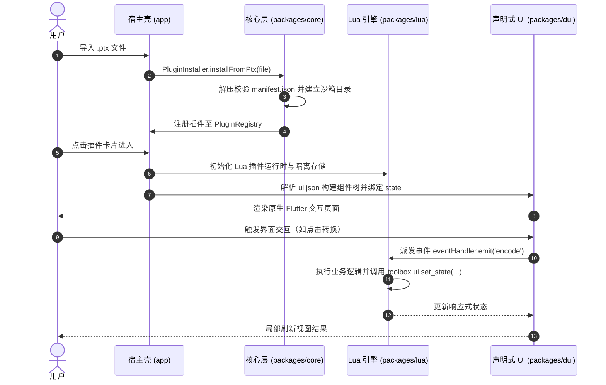

<div align="center">


# PluginToolbox

**PluginToolbox —— 基于轻量沙箱与动态声明式 UI 的 Android 插件工具箱**

一个高度解耦、完全离线、支持热插拔的现代化 Android 工具箱应用。无需重新编译宿主，用户只需导入一个 `.ptx` 插件包，即可即时运行全新功能。

[](https://flutter.dev)
[](https://dart.dev)
[](#安装与运行)
[](LICENSE)
[](#架构设计)

**简体中文** · [English](README.en.md)

</div>

---

## 核心特性

- **动态热插拔插件生态**：
  - 基于标准 Zip 归档格式的 `.ptx` (Plugin Toolbox Extension) 插件包，支持一键安装、即刻启用与安全卸载。
  - 每个动态插件拥有独立沙箱存储空间，防止插件间数据污染与越权访问。
- **声明式动态 UI (DUI)**：
  - 纯 JSON 描述组件树（`ui.json`），由宿主运行时原生映射为高性能 Flutter Widget。
  - 支持 `${state.key}` 响应式数据绑定与事件驱动机制，无需编写复杂的前端逻辑。
- **轻量受控脚本引擎**：
  - 内置沙箱级 Lua 脚本运行时（`entry.lua`），兼具高性能与轻量化。
  - 提供安全宿主 API 集合：剪贴板（`toolbox.clipboard`）、沙箱存储（`toolbox.storage`）、系统信息与日志追踪。


---

## 架构设计

本工程采用清晰的 Monorepo 分层架构，各子模块职责单一、单向依赖：

```
plugin-toolbox/
├── app/                  # Android 宿主主工程（Flutter App）
│   ├── lib/              # 页面、路由 (go_router)、全局状态 (Riverpod)
│   └── test/             # 宿主 Widget 测试与组件交互测试
├── packages/
│   ├── core/             # 领域核心：插件模型、注册中心、安装器与隔离服务（纯 Dart）
│   ├── lua/              # 脚本执行层：Lua 5.1/LuaJIT 脚本引擎与沙箱 API 绑定
│   ├── dui/              # 声明式 UI 引擎：JSON AST -> Flutter Widget 动态渲染
│   └── ui/               # 共享表现层：AppTheme 品牌主题系统与通用组件库
├── sample_plugins/       # 官方样例插件源码与打包脚本 (pack.py)
│   ├── base64_tool/      # Base64 文本编解码插件
│   └── hash_tool/        # MD5 / SHA-1 / SHA-256 哈希计算插件
├── tool/                 # 独立质量工程工具套件 (verify.dart, shots.py)
└── AGENTS.md             # 统一架构标准、开发门槛与 AI Agent 协作规范
```

### 插件加载与运行流程



---

## `.ptx` 插件规范与编写指南

一个标准的 `.ptx` 实际上是一个普通的 Zip 归档包（后缀为 `.ptx`），其根目录下包含以下文件：

```
my_plugin.ptx
├── manifest.json         # 插件清单与元数据（必选）
├── entry.lua             # 核心逻辑脚本（必选）
├── ui.json               # 声明式组件树定义（必选）
└── icon.png              # 插件图标，推荐 128x128 PNG（可选）
```

### 1. 插件清单 (`manifest.json`)

```json
{
  "id": "base64_tool",
  "name": "Base64 编解码",
  "version": "1.0.0",
  "description": "Base64 文本编码与解码转换工具",
  "author": "PluginToolbox Team",
  "type": "lua",
  "category": "utility",
  "entry": "entry.lua",
  "ui": "ui.json",
  "permissions": ["storage", "clipboard"]
}
```

### 2. 声明式 UI (`ui.json`)

```json
{
  "type": "Column",
  "props": {
    "crossAxisAlignment": "stretch"
  },
  "children": [
    {
      "type": "TextField",
      "props": {
        "label": "输入文本",
        "value": "${state.input_text}",
        "maxLines": 4
      },
      "events": {
        "onChanged": "on_input_changed"
      }
    },
    {
      "type": "Row",
      "children": [
        {
          "type": "ElevatedButton",
          "props": { "label": "编码" },
          "events": { "onTap": "on_encode" }
        }
      ]
    },
    {
      "type": "Card",
      "children": [
        {
          "type": "Text",
          "props": { "text": "${state.result_text}" }
        }
      ]
    }
  ]
}
```

### 3. 业务脚本 (`entry.lua`)

```lua
-- 初始化插件状态
toolbox.ui.set_state({
    input_text = "",
    result_text = ""
})

-- 输入文本监听
function on_input_changed(value)
    toolbox.ui.set_state({ input_text = value })
end

-- 编码点击事件
function on_encode()
    local text = toolbox.ui.get_state("input_text") or ""
    local encoded = toolbox.crypto.base64_encode(text)
    toolbox.ui.set_state({ result_text = encoded })
end
```

### 4. 插件跨平台打包 (`sample_plugins/pack.py`)

在工程根目录下执行跨平台 Python 打包脚本：

```bash
# 一键打包所有插件目录为 .ptx
python sample_plugins/pack.py

# 或打包指定插件
python sample_plugins/pack.py base64_tool
```

---

## 安装与运行

### 1. 从源码编译

要求环境：
- Flutter SDK 3.29+ / Dart SDK 3.7+
- Android SDK (API 34+), Java 17+
- Python 3.10+ (用于质量工具与插件打包)

```bash
# 克隆仓库
git clone https://github.com/Aclguh/plugin-toolbox.git
cd plugin-toolbox

# 安装依赖
flutter pub get
cd app && flutter pub get

# 启动调试（需连接真机或启动模拟器）
flutter run
```

### 2. 生产打包 (Split APK)

为优化安装包体积，推荐按 ABI 拆分打包：

```bash
cd app
flutter build apk --release --split-per-abi
# 输出产物：
# - build/app/outputs/flutter-apk/app-arm64-v8a-release.apk (主流机型推荐)
# - build/app/outputs/flutter-apk/app-armeabi-v7a-release.apk (老旧机型)
# - build/app/outputs/flutter-apk/app-x86_64-release.apk (模拟器)
```

---

## 验证与测试

本项目采用严格的质量保障体系（详见 [AGENTS.md](AGENTS.md)），遵循**软件测试只做软件本身测试、不做插件测试**的职责边界。在声明完成或发布前执行：

```bash
# 1. 静态代码分析（保持 0 错误 0 警告）
dart analyze

# 2. 独立规范与逻辑自动化验证（纯 Dart 快速执行，63 项断言全通过）
dart run tool/verify.dart

# 3. 分层单元测试与 Widget 测试（纯软件架构与宿主交互测试，无需外部设备）
cd packages/core && flutter test
cd packages/lua && flutter test
cd packages/dui && flutter test
cd packages/ui && flutter test
cd app && flutter test

# 4. 真机截图与视觉规范验证（需连接真机，自动裁剪系统栏并压缩）
python tool/shots.py 01-home 02-manager 03-settings
```

---


## 许可证与致谢

- 本项目源码采用 [MIT License](LICENSE) 授权开源。
- 核心依赖致谢：
  - [Flutter](https://flutter.dev) & [Dart](https://dart.dev)
  - [Riverpod](https://riverpod.dev) —— 高性能响应式状态管理框架
  - [GoRouter](https://pub.dev/packages/go_router) —— 声明式路由导航
  - [Archive](https://pub.dev/packages/archive) —— 高性能跨平台解压缩引擎
  - [ReorderableGridView](https://pub.dev/packages/reorderable_grid_view) —— 流畅的网格拖拽排序支持
